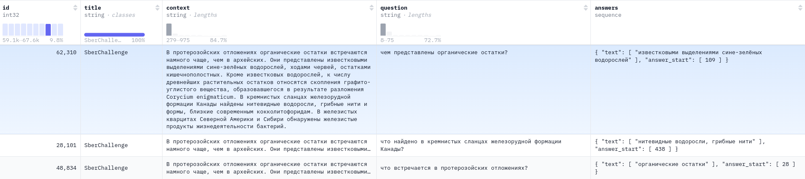

# Отборочное задание на смену по машинному обучению в Сириус

## Описание задачи:
В рамках отборочного задания требуется реализовать русскоязычную систему QA-систему. Основной задачей является построение модели, способной эффективно извлекать релевантную информацию и находить в вопросе соответствующие фрагменты.

## Цель:
Создать и продемонстрировать работоспособную систему для решения задачи вопросов-ответов (QA). Система должна быть развёрнута в виде телеграм-бота или веб-сервиса, доступного для взаимодействия, и демонстрировать корректные результаты на реальных примерах.

## Описание исходных данных
В качестве исходных данных представлен датасет **kuznetsoffandrey/sberquad** [https://huggingface.co/datasets/kuznetsoffandrey/sberquad].

**SberQuAD** — это датасет для задач QA, основанный на вопросах, созданных краудворкерами по набору статей из Википедии. Ответом на каждый вопрос является текстовый фрагмент из соответствующего отрывка статьи. Датасет является русскоязычным аналогом популярного англоязычного датасета SQuAD

context - фрагмент из Википедии

question - вопрос к фрагменту

answers - ответ на вопрос, основанный на контексте

## Разработка решения

### Выбор решения:
Из предложенных решений было выбрано реализвать систему Retrieval Augmented Generation(RAG), которая является одной из эффективнейших реализаций QA-систем.

## Результы